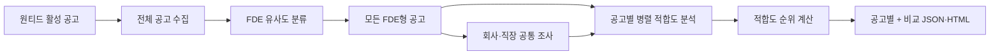
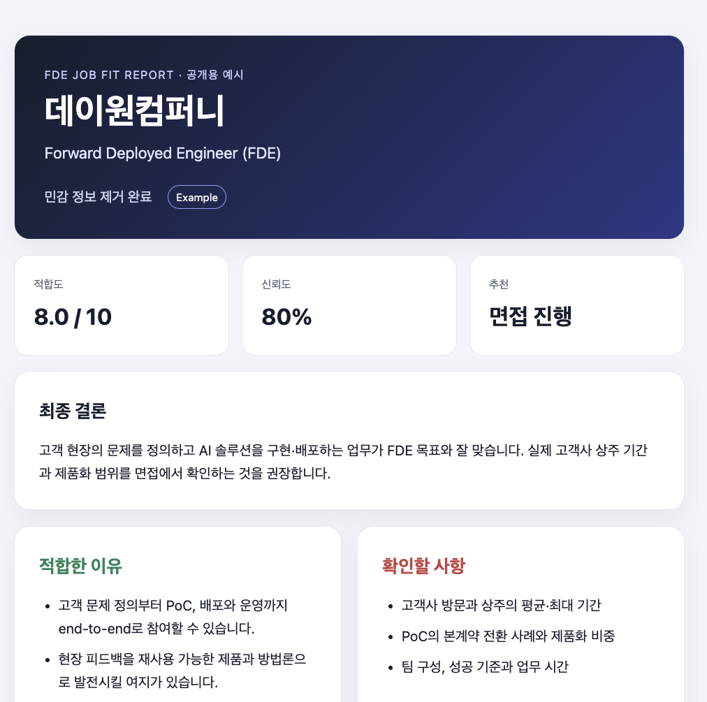
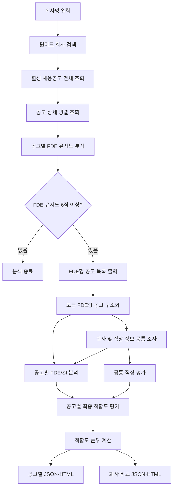
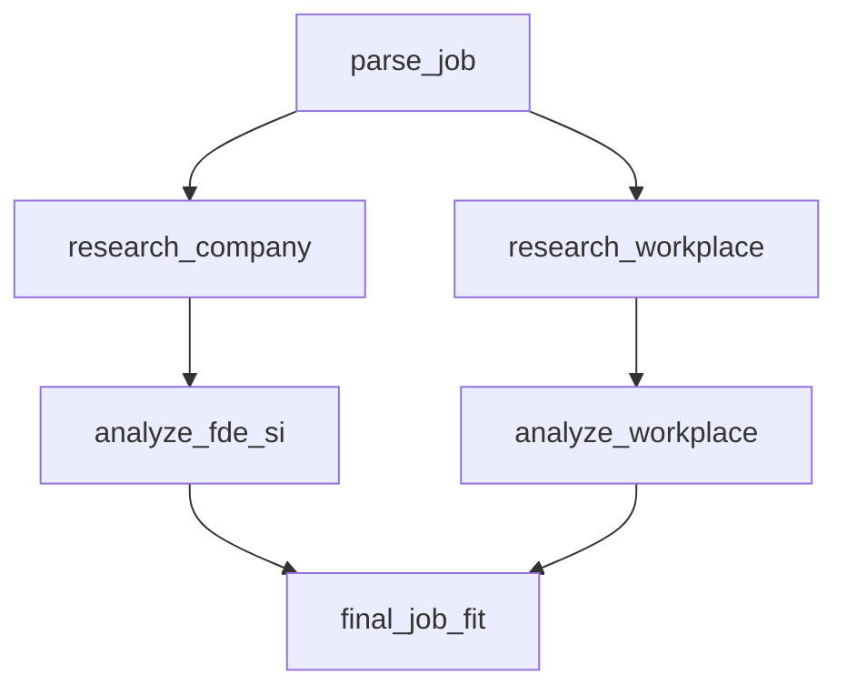

# fde-fit

`fde-fit`은 특정 회사의 원티드 활성 채용공고를 모두 확인하고, 실제 업무가
FDE(Forward Deployed Engineer)에 가까운 공고를 찾아 후보자와의 직무 적합도를
분석하는 프로그램입니다.

공고 제목에 `FDE`가 없어도 고객 문제 정의, 직접 구현과 배포, 고객 현장 협업
등의 업무가 포함되어 있으면 FDE형 공고로 판단할 수 있습니다. 발견된 FDE형
공고는 기본적으로 모두 분석하고 후보자 적합도 순위를 계산합니다. 공고별 결과와
회사 단위 비교 보고서를 JSON 및 브라우저에서 열 수 있는 HTML로 저장합니다.

## 한눈에 보기

원티드에서 데이원컴퍼니의 활성 공고를 수집하고 FDE 유사도를 분류한 뒤, 발견한
FDE형 공고를 모두 회사·직장 조사와 후보자 적합도 분석으로 연결합니다. 회사와
직장에 대한 공통 조사는 한 번만 실행하고, 공고별 분석은 병렬 처리합니다.



### 예시 결과: 데이원컴퍼니 FDE

아래 화면은 후보자 식별 정보와 연봉 등 보상 정보를 제거한 공개용 HTML 예시입니다.

[](docs/day1-fde-example.html)

예시 원문: [docs/day1-fde-example.html](docs/day1-fde-example.html)

## 주요 기능

- 회사명으로 원티드 회사 검색
- 해당 회사의 활성 채용공고 전체 조회
- 공고 상세 내용 병렬 수집
- 모든 활성 공고의 FDE 유사도 분석
- FDE형 공고의 점수, 신뢰도와 판정 근거 출력
- 모든 FDE형 공고 자동 분석 및 후보자 적합도 순위 계산
- 회사 및 직장 정보는 한 번만 병렬 조사해 모든 공고에서 공유
- 공고별 구조화, FDE/SI 특성 및 최종 적합도 병렬 분석
- 후보자 우선순위를 반영한 최종 직무 적합도 평가
- 공고별 JSON·HTML과 회사 단위 비교 JSON·HTML 보고서 생성
- 기존 로컬 `job.txt` 분석 지원

## 전체 처리 흐름



## FDE형 공고 판정

회사의 모든 활성 공고를 최대 5개씩 묶어 `gpt-5-mini`로 분석합니다. 직무명보다
공고의 주요 업무와 자격요건을 우선적으로 평가합니다.

### 주요 판단 기준

- 고객 또는 고객사 현장에서 직접 긴밀하게 일하는가
- 고객의 모호한 문제를 기술 문제와 요구사항으로 정의하는가
- 엔지니어가 직접 코드를 작성하고 솔루션을 구현하는가
- PoC부터 배포와 운영 안정화까지 end-to-end로 책임지는가
- 현장에서 얻은 피드백을 공통 제품이나 플랫폼 개선으로 환원하는가
- 제품팀과 고객 사이에서 기술적 가교 역할을 하는가

### FDE로 판단하지 않는 사례

- 고객 접점이 없는 일반적인 내부 제품 개발
- 코딩과 구현 책임이 없는 영업, CSM, PM 또는 컨설팅
- 단순 기술지원
- 정해진 요구사항만 구현하거나 유지보수하는 일반 개발
- 회사 소개에만 AI나 B2B가 있고 해당 포지션 업무에는 FDE 신호가 없는 경우

### 점수 기준

| 점수 | 의미 |
| ---: | --- |
| 0~2 | FDE와 무관 |
| 3~5 | 일부 유사하지만 FDE로 보기 어려움 |
| 6~7 | 직무명이 달라도 실제 업무가 FDE에 가까움 |
| 8~10 | 명백한 FDE 역할 |

FDE 유사도가 `6점 이상`이면 FDE형 공고로 취급합니다. 제목에 `FDE` 또는
`Forward Deployed Engineer`가 명시된 공고는 누락되지 않도록 최소 8점으로
보정합니다.

## 분석 구조

각 FDE형 공고에는 기존 LangGraph와 동일한 분석 노드를 사용합니다. 단일 공고와
로컬 `job.txt` 분석은 다음 그래프에서 처리됩니다.



`research_company`와 `research_workplace`는 `parse_job`이 끝난 후 병렬로
실행됩니다. 두 분석 브랜치가 모두 끝나야 `final_job_fit`이 한 번 실행됩니다.

회사 검색 모드에서는 이 구조를 여러 공고로 확장합니다. 모든 공고를 병렬
구조화한 뒤 `research_company`와 `research_workplace`를 회사당 한 번만 병렬
실행합니다. 조사 결과를 공유하면서 공고별 `analyze_fde_si`와 `final_job_fit`을
병렬 실행하고, 최종 적합도에 따라 순위를 정합니다.

순위는 다음 값을 차례대로 비교해 내림차순으로 결정합니다.

1. 최종 후보자 적합도 `fit_score`
2. 최종 분석 신뢰도 `confidence`
3. 정밀 분석의 `fde_si_analysis.fde_score`
4. 최초 탐색 단계의 `fde_classification.fde_score`

### 노드별 역할

| 노드 | 역할 |
| --- | --- |
| `parse_job` | 공고에서 회사명, 포지션, 주요 업무, 자격요건과 기술 스택 추출 |
| `research_company` | 제품, 고객 사례, 사업 모델과 최근 활동 조사 |
| `research_workplace` | 연봉, 워라밸, 조직문화, 경영진, 안정성과 성장성 조사 |
| `analyze_fde_si` | 포지션이 FDE와 SI 중 어디에 가까운지 평가 |
| `analyze_workplace` | 직장 환경의 강점, 위험과 면접 확인 질문 생성 |
| `final_job_fit` | 후보자 프로필과 모든 분석 결과를 종합해 최종 적합도 평가 |

## 요구 사항

- Python 3.12 이상
- [uv](https://docs.astral.sh/uv/)
- OpenAI API 키
- Tavily API 키

의존성을 설치합니다.

```bash
uv sync
```

프로젝트 루트에 `.env` 파일을 만들고 인증 정보를 설정합니다.

```dotenv
OPENAI_API_KEY=your-openai-api-key
TAVILY_API_KEY=your-tavily-api-key
```

OpenAI는 활성 공고의 FDE 유사도 분류와 LangGraph의 구조화 분석에 사용합니다.
Tavily는 회사와 직장 관련 공개 자료를 검색하는 데 사용합니다. 원티드 공고
조회 자체에는 별도 인증 정보가 필요하지 않습니다.

## 후보자 프로필

기본 후보자 정보는 `candidate_profile.json`에서 읽습니다. 최종 평가는 이 파일의
경력, 선호 조건과 `priorities`를 반영합니다.

다른 프로필을 사용하려면 실행 시 파일을 지정합니다.

```bash
uv run python workflow.py \
  --company "회사명" \
  --candidate-profile another_profile.json
```

## 실행 방법

### 원티드 회사 검색 후 분석

```bash
uv run python workflow.py --company "회사명"
```

활성 공고가 없거나 실제 업무가 FDE에 가까운 공고가 없으면 추가 LangGraph 분석
없이 종료합니다.

FDE형 공고가 하나 이상이면 별도의 선택 입력 없이 모든 공고를 자동 분석하고
종합 순위를 생성합니다.

### HTML 보고서 자동 열기

```bash
uv run python workflow.py --company "회사명" --open
```

### 특정 FDE형 공고만 분석

기본 동작은 모든 FDE형 공고를 분석하는 것입니다. 실행 범위를 하나로 제한하려면
원티드 공고 ID를 지정합니다. 지정한 ID가 검색된 FDE형 공고가 아니면 오류로
종료합니다.

```bash
uv run python workflow.py \
  --company "회사명" \
  --job-id 123456
```

### 결과 저장 위치 지정

```bash
uv run python workflow.py \
  --company "회사명" \
  --output-dir reports
```

### 기존 `job.txt` 분석

`--company`를 생략하면 기존 로컬 공고 파일을 분석합니다.

```bash
uv run python workflow.py
```

다른 공고 파일을 사용하려면 다음과 같이 실행합니다.

```bash
uv run python workflow.py --job-file another_job.txt
```

### 전체 옵션 확인

```bash
uv run python workflow.py --help
```

## 결과 파일

분석이 완료되면 지정된 출력 디렉터리에 JSON과 HTML 파일을 함께 생성합니다.

```text
회사명_공고ID_final_job_fit.json
회사명_공고ID_final_job_fit.html
회사명_fde_comparison.json
회사명_fde_comparison.html
```

공고별 파일은 기존 `final_job_fit` 출력 구조를 그대로 유지합니다. 동일한 회사에
직무명이 같은 공고가 있어도 원티드 공고 ID가 파일명에 포함되므로 서로 덮어쓰지
않습니다. 로컬 `job.txt` 모드에서는 기존 파일명인
`회사명_final_job_fit.json`과 `회사명_final_job_fit.html`을 사용합니다.

JSON은 다음 구조를 유지합니다.

```json
{
  "fit_score": 8.0,
  "confidence": 0.8,
  "recommendation": "지원 추천",
  "why_fit": [
    "후보자와 포지션이 잘 맞는 이유"
  ],
  "concerns": [
    "지원 또는 입사 시 주의할 사항"
  ],
  "must_verify_before_joining": [
    "면접이나 입사 전에 확인해야 할 내용"
  ],
  "final_conclusion": "최종 판단"
}
```

공고별 HTML 보고서에는 다음 내용이 표시됩니다.

- 회사명과 포지션
- 원티드 원본 공고 링크
- 직무 적합도와 분석 신뢰도
- 지원 추천
- 적합한 이유와 우려 사항
- 입사 전에 반드시 확인할 내용
- 최종 결론
- 원본 JSON

회사 단위 비교 보고서에는 종합 순위, 공고별 적합도·신뢰도·FDE/SI 점수,
추천과 판정 근거, 공통 직장 평가 및 전체 비교 JSON이 포함됩니다.

## 프로젝트 구성

| 파일 | 역할 |
| --- | --- |
| `workflow.py` | CLI, 전체 실행 흐름과 LangGraph 정의 |
| `wanted_jobs.py` | 원티드 회사·공고 검색과 상세 병렬 조회 |
| `classify_fde.py` | 모든 활성 공고의 FDE 유사도 분석 |
| `multi_job_analysis.py` | 모든 FDE형 공고의 공통 조사, 병렬 분석과 순위 계산 |
| `comparison_report.py` | 회사 단위 비교 JSON 및 HTML 보고서 생성 |
| `parse_job.py` | 채용공고 구조화 |
| `research_company.py` | 회사와 사업 조사 |
| `research_workplace.py` | 직장 관련 근거 조사 |
| `analyze_fde_si.py` | FDE 및 SI 특성 평가 |
| `analyze_workplace.py` | 직장 환경 평가 |
| `final_job_fit.py` | 최종 직무 적합도 평가 |
| `job_state.py` | LangGraph 공유 상태 정의 |
| `html_report.py` | JSON 및 HTML 보고서 생성 |
| `candidate_profile.json` | 후보자의 경력과 우선순위 |
| `job.txt` | 로컬 분석용 채용공고 |
| `tests/` | 검색, 분류, 워크플로와 보고서 테스트 |

## 테스트

```bash
uv run python -m unittest discover -s tests -v
```

테스트는 다음 동작을 확인합니다.

- 회사명 정규화 및 선택
- 활성 공고 전체 상세 조회
- 여러 배치에 걸친 전체 공고 FDE 판정
- 일반적인 직무명의 FDE형 판정
- 명시적인 FDE 제목의 누락 방지
- CLI 전체 FDE형 공고 자동 분석과 `--job-id` 범위 제한
- 회사 공통 조사를 한 번만 실행하는 다중 공고 분석
- 최종 적합도 기반 순위 계산
- 공고 ID 기반 개별 보고서와 회사 단위 비교 보고서 생성
- HTML 특수문자 escaping

## 오류 처리

- 회사 검색 결과가 없으면 후보 회사 정보를 포함한 오류를 출력합니다.
- 일부 활성 공고의 상세 조회가 실패하면 불완전한 상태로 판정하지 않고 중단합니다.
- LLM이 일부 공고 ID를 누락하거나 중복 반환하면 FDE 분류를 중단합니다.
- `--job-id`가 검색된 FDE형 공고가 아니면 사용 가능한 공고 ID를 출력합니다.
- 잘못된 후보자 JSON이나 존재하지 않는 파일은 오류 코드 `2`로 종료합니다.

## 주의사항

- FDE 판정과 최종 적합도는 AI가 생성한 참고용 분석입니다.
- 모든 활성 공고는 FDE 후보 탐색 단계에서 분석하고, 발견된 FDE형 공고는
  기본적으로 모두 정밀 직무 적합도 분석을 실행합니다. `--job-id`를 지정하면
  해당 공고 하나만 분석합니다.
- 공개적으로 확인할 수 없는 연봉이나 조직문화 정보는 결과의 신뢰도가 낮을 수
  있습니다.
- 원티드 웹 응답 구조가 변경되면 공고 조회 코드 수정이 필요할 수 있습니다.
- 공고 수에 따라 OpenAI 호출 횟수와 실행 시간이 증가할 수 있습니다.
