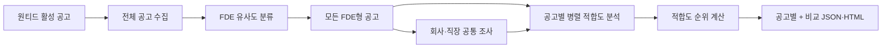
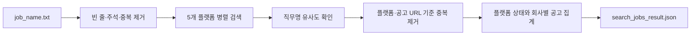
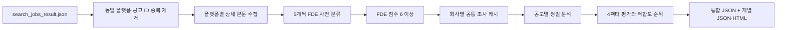
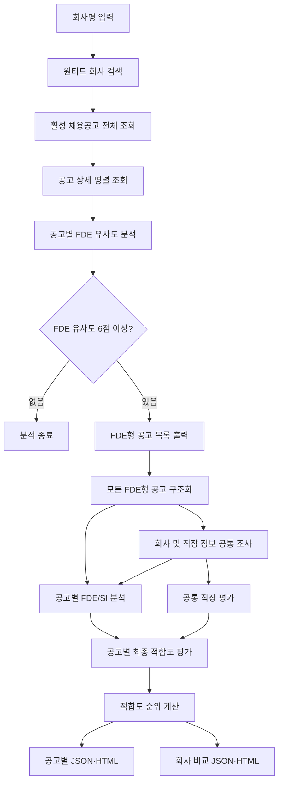
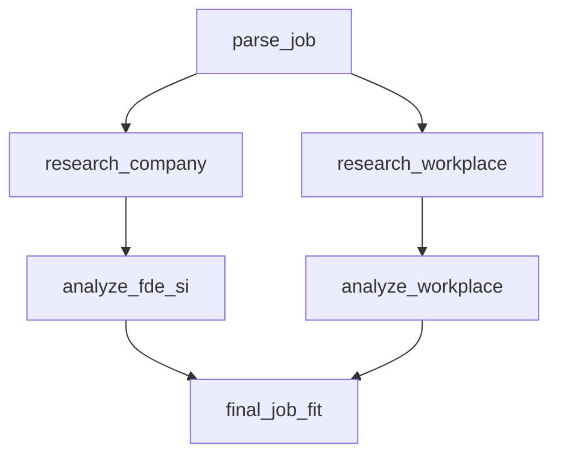

# fde-fit

`fde-fit`은 관심 직무가 채용 중인 회사를 여러 채용 플랫폼에서 찾고, 특정 회사의 활성
채용공고 중 실제 업무가 FDE(Forward Deployed Engineer)에 가까운 공고를 찾아
후보자와의 직무 적합도를 분석하는 프로그램입니다.

공고 제목에 `FDE`가 없어도 고객 문제 정의, 직접 구현과 배포, 고객 현장 협업
등의 업무가 포함되어 있으면 FDE형 공고로 판단할 수 있습니다. 발견된 FDE형
공고는 기본적으로 모두 분석하고 후보자 적합도 순위를 계산합니다. 공고별 결과와
회사 단위 비교 보고서를 JSON 및 브라우저에서 열 수 있는 HTML로 저장합니다.

프로그램은 세 가지 실행 경로를 제공합니다.

| 목적 | 입력 | 실행 파일 | 결과 |
| --- | --- | --- | --- |
| 관심 직무의 유사 공고 통합 검색 | `job_name.txt` | `search_jobs.py` | `search_jobs_result.json` |
| 통합 검색 결과의 FDE 선별·정밀 분석 | `search_jobs_result.json` | `analyze_search_results.py` | 통합 순위 JSON과 공고별·회사별 보고서 |
| 특정 회사의 FDE형 공고 분석 | 회사명 또는 `job.txt` | `workflow.py` | 공고별·회사별 JSON/HTML |

## 한눈에 보기

원티드에서 데이원컴퍼니의 활성 공고를 수집하고 FDE 유사도를 분류한 뒤, 발견한
FDE형 공고를 모두 회사·직장 조사와 후보자 적합도 분석으로 연결합니다. 회사와
직장에 대한 공통 조사는 한 번만 실행하고, 공고별 분석은 병렬 처리합니다.



### 예시 결과: 데이원컴퍼니 FDE

아래 화면은 후보자 식별 정보와 연봉 등 보상 정보를 제거한 공개용 HTML 예시입니다.

[](docs/day1-fde-example.html)

예시 원문: [docs/day1-fde-example.html](docs/day1-fde-example.html)

## 주요 기능

- `job_name.txt`의 여러 직무명을 원티드·그룹바이·사람인·링크드인·잡플래닛에서 병렬 검색
- 대소문자, 단수·복수, 약어와 단어 포함률을 반영한 유사 직무명 판정
- 플랫폼별 공고 URL 중복 제거, 회사별 집계와 `ok`·`partial`·`skipped`·`error` 상태 저장
- 통합 검색 결과의 상세 본문 수집, FDE 사전 분류와 모든 FDE형 공고 정밀 분석
- 회사별 조사 결과 공유, 중단 후 재개 가능한 체크포인트와 전체 적합도 순위 생성
- 회사명으로 원티드 회사 검색
- 해당 회사의 활성 채용공고 전체 조회
- 공고 상세 내용 병렬 수집
- 모든 활성 공고의 FDE 유사도 분석
- FDE형 공고의 점수, 신뢰도와 판정 근거 출력
- 모든 FDE형 공고 자동 분석 및 후보자 적합도 순위 계산
- 회사 및 직장 정보는 한 번만 병렬 조사해 모든 공고에서 공유
- 공고별 구조화, FDE/SI 특성 및 최종 적합도 병렬 분석
- 후보자 우선순위를 반영한 최종 직무 적합도 평가
- 공고별 JSON·HTML과 회사 단위 비교 JSON·HTML 보고서 생성
- 연봉·워라밸·안정성·성장성을 점수와 신뢰도로 기록하는 범용 JSON 템플릿 제공
- 기존 로컬 `job.txt` 분석 지원

## 전체 처리 흐름

### 직무명 기반 통합 공고 검색



각 검색 서비스는 관련도가 낮은 결과도 함께 반환할 수 있습니다. 프로그램은
대소문자와 문장부호, `Solution`/`Solutions` 등의 단수·복수 차이를 정규화하고
단어 포함률을 점수화해 유사 공고인지 다시 확인합니다. `Forward Deployed
Engineer`는 제목의 `FDE`, `Forward Deployed Software Engineer`는 `FDSE`
표기도 인식합니다.

### 플랫폼별 검색 방식

| 플랫폼 | 검색 방식 | 인증 | 기본 확인 범위 |
| --- | --- | --- | ---: |
| 원티드 | 원티드 공개 웹 검색 엔드포인트 | 불필요 | 직무명당 100건 |
| 그룹바이 | Tavily `groupby.kr` 도메인 검색 | `TAVILY_API_KEY` | 직무명당 20건 |
| 사람인·점핏 | Tavily `saramin.co.kr` 도메인 검색 | `TAVILY_API_KEY` | 직무명당 20건 |
| 링크드인 | Tavily `linkedin.com` 도메인 검색 | `TAVILY_API_KEY` | 직무명당 20건 |
| 잡플래닛 | Tavily `jobplanet.co.kr` 도메인 검색 | `TAVILY_API_KEY` | 직무명당 20건 |

사람인은 별도의 공식 API 키를 사용하지 않습니다. `saramin.co.kr` 하위 도메인을
검색하므로 사람인 공고와 개발자 채용 서비스인 점핏 공고가 함께 포함될 수
있습니다. 검색 결과에 과거 마감일이나 명시적인 마감 문구가 있으면 제외합니다.

`platform_summary.status`의 의미는 다음과 같습니다.

| 상태 | 의미 |
| --- | --- |
| `ok` | 해당 플랫폼의 모든 직무명 검색이 정상적으로 끝남 |
| `partial` | 일부 직무명 검색만 실패하고 나머지 결과는 저장됨 |
| `skipped` | API 키 또는 의존성이 없어 해당 플랫폼을 건너뜀 |
| `error` | 해당 플랫폼의 모든 직무명 검색이 실패함 |

최상위 `status`는 모든 플랫폼이 정상이면 `ok`, 일부 플랫폼만 사용할 수 있으면
`partial`, 사용할 수 있는 플랫폼이 하나도 없으면 `error`가 됩니다.

### 통합 검색 결과의 배치 분석



원티드 상세 본문은 공개 상세 엔드포인트로 가져오고, 그룹바이·사람인·점핏·
링크드인·잡플래닛은 Tavily Extract로 공고 페이지 본문을 추출합니다. Extract가
실패하면 같은 URL의 검색 인덱스 본문을 보조 경로로 재조회합니다. 동일 플랫폼에서
같은 공고 ID가 추적 파라미터만 다른 URL로 중복되면 하나로 병합합니다.

사전 분류에서 FDE 유사도가 6점 이상인 공고만 정밀 분석합니다. 공고별로 FDE/SI,
후보자 적합도와 연봉·워라밸·안정성·성장성 4팩터를 평가하며, 각 4팩터에는
0~10점과 0~1 신뢰도를 함께 저장합니다. 회사와 직장 조사는 같은 회사의 공고끼리
한 번만 실행해 공유합니다.

### 회사별 FDE 분석



## FDE형 공고 판정

회사의 모든 활성 공고를 최대 5개씩 묶어 `gpt-5-mini`로 분석합니다. 직무명보다
공고의 주요 업무와 자격요건을 우선적으로 평가합니다.

### 주요 판단 기준

- 고객 또는 고객사 현장에서 직접 긴밀하게 일하는가
- 고객의 모호한 문제를 기술 문제와 요구사항으로 정의하는가
- 엔지니어가 직접 코드를 작성하고 솔루션을 구현하는가
- PoC부터 배포와 운영 안정화까지 end-to-end로 책임지는가
- 현장에서 얻은 피드백을 공통 제품이나 플랫폼 개선으로 환원하는가
- 제품팀과 고객 사이에서 기술적 가교 역할을 하는가

### FDE로 판단하지 않는 사례

- 고객 접점이 없는 일반적인 내부 제품 개발
- 코딩과 구현 책임이 없는 영업, CSM, PM 또는 컨설팅
- 단순 기술지원
- 정해진 요구사항만 구현하거나 유지보수하는 일반 개발
- 회사 소개에만 AI나 B2B가 있고 해당 포지션 업무에는 FDE 신호가 없는 경우

### 점수 기준

| 점수 | 의미 |
| ---: | --- |
| 0~2 | FDE와 무관 |
| 3~5 | 일부 유사하지만 FDE로 보기 어려움 |
| 6~7 | 직무명이 달라도 실제 업무가 FDE에 가까움 |
| 8~10 | 명백한 FDE 역할 |

FDE 유사도가 `6점 이상`이면 FDE형 공고로 취급합니다. 제목에 `FDE` 또는
`Forward Deployed Engineer`가 명시된 공고는 누락되지 않도록 최소 8점으로
보정합니다.

## 분석 구조

각 FDE형 공고에는 기존 LangGraph와 동일한 분석 노드를 사용합니다. 단일 공고와
로컬 `job.txt` 분석은 다음 그래프에서 처리됩니다.



`research_company`와 `research_workplace`는 `parse_job`이 끝난 후 병렬로
실행됩니다. 두 분석 브랜치가 모두 끝나야 `final_job_fit`이 한 번 실행됩니다.

회사 검색 모드에서는 이 구조를 여러 공고로 확장합니다. 모든 공고를 병렬
구조화한 뒤 `research_company`와 `research_workplace`를 회사당 한 번만 병렬
실행합니다. 조사 결과를 공유하면서 공고별 `analyze_fde_si`와 `final_job_fit`을
병렬 실행하고, 최종 적합도에 따라 순위를 정합니다.

순위는 다음 값을 차례대로 비교해 내림차순으로 결정합니다.

1. 최종 후보자 적합도 `fit_score`
2. 최종 분석 신뢰도 `confidence`
3. 정밀 분석의 `fde_si_analysis.fde_score`
4. 최초 탐색 단계의 `fde_classification.fde_score`

### 노드별 역할

| 노드 | 역할 |
| --- | --- |
| `parse_job` | 공고에서 회사명, 포지션, 주요 업무, 자격요건과 기술 스택 추출 |
| `research_company` | 제품, 고객 사례, 사업 모델과 최근 활동 조사 |
| `research_workplace` | 연봉, 워라밸, 조직문화, 경영진, 안정성과 성장성 조사 |
| `analyze_fde_si` | 포지션이 FDE와 SI 중 어디에 가까운지 평가 |
| `analyze_workplace` | 직장 환경의 강점, 위험과 면접 확인 질문 생성 |
| `final_job_fit` | 후보자 프로필과 모든 분석 결과를 종합해 최종 적합도 평가 |

## 요구 사항

- Python 3.12 이상
- [uv](https://docs.astral.sh/uv/)

원티드 직무 검색에는 별도 API 키가 필요하지 않습니다. 그룹바이·사람인·링크드인·
잡플래닛 검색에는 Tavily API 키를 사용합니다. `search_jobs.py`만 실행할 때는
OpenAI API 키가 필요하지 않습니다. FDE 판정과 직무 적합도 분석을 실행할 때는
OpenAI API 키도 필요합니다.

| 실행 기능 | 필요한 키 |
| --- | --- |
| 원티드 공고 검색 | 없음 |
| 그룹바이·사람인·링크드인·잡플래닛 검색 | `TAVILY_API_KEY` |
| 회사·직장 공개 자료 조사 | `TAVILY_API_KEY` |
| FDE 판정 및 직무 적합도 분석 | `OPENAI_API_KEY` |
| 통합 검색 결과 배치 분석 | `OPENAI_API_KEY`, `TAVILY_API_KEY` |

의존성을 설치합니다.

```bash
uv sync
```

프로젝트 루트에 `.env` 파일을 만들고 인증 정보를 설정합니다.

```dotenv
OPENAI_API_KEY=your-openai-api-key
TAVILY_API_KEY=your-tavily-api-key
```

OpenAI는 활성 공고의 FDE 유사도 분류와 LangGraph의 구조화 분석에 사용합니다.
Tavily는 회사·직장 조사와 사람인을 포함한 네 플랫폼의 도메인 제한 검색에
사용합니다. Tavily 키가 없으면 해당 네 플랫폼을 `skipped`로 기록하고 원티드
검색은 계속합니다.

## 후보자 프로필

기본 후보자 정보는 `candidate_profile.json`에서 읽습니다. 최종 평가는 이 파일의
경력, 선호 조건과 `priorities`를 반영합니다. `candidate_profile*.json`은 개인정보를
포함하는 로컬 입력 파일이므로 Git에서 추적하지 않습니다.

다른 프로필을 사용하려면 실행 시 파일을 지정합니다.

```bash
uv run python workflow.py \
  --company "회사명" \
  --candidate-profile another_profile.json
```

## 범용 4팩터 평가 템플릿

`job_evaluation_template.json`은 특정 회사나 후보자에게 종속되지 않은 독립 평가
양식입니다. 회사와 채용공고를 다음 네 가지 팩터로 비교할 때 복사해서 사용할 수
있습니다.

| 팩터 | 평가 범위 |
| --- | --- |
| `salary` | 기본급, 성과급, 스톡옵션, 복리후생과 보상 투명성 |
| `work_life_balance` | 실제 근무시간, 초과근무, 휴가, 유연근무, 출장·상주 부담 |
| `stability` | 현금흐름, 런웨이, 고객 집중도와 향후 2년간 회사·직무의 존속 가능성 |
| `growth` | 시장·사업 성장과 기술, 역할, 경력 자산의 확장 가능성 |

각 팩터에는 다음 정보를 기록합니다.

- `score`: 0~10점. 높을수록 좋은 조건을 의미합니다.
- `confidence`: 0~1. 점수가 아니라 근거의 품질과 충분성을 나타내며 화면에서는
  백분율로 표시할 수 있습니다.
- `summary`: 점수와 신뢰도를 설명하는 요약입니다.
- `positive_signals`, `risks`, `unknowns`: 긍정 신호, 위험과 확인되지 않은 정보입니다.
- `evidence`: 출처, 주장, 방향성과 품질·관련성·최신성·독립성을 기록하는 배열입니다.

기본 가중치는 네 팩터에 각각 25%입니다. 목적에 따라 `factor_weights`를 바꿀 수
있지만 합계는 항상 1이어야 합니다. 모든 팩터를 작성한 뒤 `summary`에는 다음
기준으로 종합값을 기록합니다.

```text
weighted_score = sum(score × weight)
overall_confidence = sum(confidence × weight)
confidence_adjusted_score = sum((5 + (score - 5) × confidence) × weight)
```

`confidence_adjusted_score`는 근거가 약한 평가를 중립값 5에 가깝게 보정합니다.
정보가 없을 때는 낮다는 의미의 `0`을 넣지 않고 `null`을 유지하며, 네 팩터가 모두
확인되기 전에는 종합 점수도 `null`로 둡니다. 신뢰도 구간, 상세 평가 항목과 근거
객체 형식은 템플릿 안의 `scale`, `confidence_rules`, `evidence_schema`에 정의되어
있습니다.

예를 들어 원본을 보존하면서 회사·공고별 파일을 만들 수 있습니다.

```bash
cp job_evaluation_template.json example_company_job_evaluation.json
```

이 템플릿은 현재 `workflow.py`의 자동 분석 결과 형식을 변경하지 않으며, 수동 평가나
후속 자동화에서 재사용하기 위한 별도 파일입니다.

## 실행 방법

### 직무명 목록으로 여러 플랫폼의 공고 검색

`job_name.txt`에 한 줄당 하나의 직무명을 입력한 뒤 다음 명령을 실행합니다.

```text
Forward Deployed Engineer
Applied AI Engineer
Solutions Engineer
```

빈 줄과 `#`으로 시작하는 주석은 무시하며, 대소문자만 다른 중복 직무명은 한 번만
검색합니다.

```bash
uv run python search_jobs.py
```

원티드·그룹바이·사람인·링크드인·잡플래닛에서 유사 공고를 찾고 기본적으로
`search_jobs_result.json`에 저장합니다. 같은 플랫폼 공고가 여러 직무명에
일치하면 중복 저장하지 않고 `matched_job_names`에 모두 기록합니다. JSON에는
통합 `jobs`, 회사별 `companies`, 그리고 각 플랫폼의 검색 방식과 상태를 담은
`platform_summary`가 포함됩니다.

출력 파일, 플랫폼과 직무명별 검색 범위를 변경할 수 있습니다.

```bash
uv run python search_jobs.py \
  --job-name-file job_name.txt \
  --output reports/search_jobs_result.json \
  --max-results-per-query 200 \
  --web-results-per-query 20
```

특정 플랫폼만 검색하려면 `--platform`을 여러 번 지정합니다.

```bash
uv run python search_jobs.py \
  --platform wanted \
  --platform linkedin
```

사람인과 점핏만 검색하려면 다음과 같이 실행합니다.

```bash
uv run python search_jobs.py --platform saramin
```

`--max-results-per-query`는 원티드의 확인 범위이며 기본값은 100건입니다.
`--web-results-per-query`는 Tavily가 플랫폼별·직무명별로 확인하는 검색 결과 수로
최대 20건입니다. 그룹바이·사람인·링크드인·잡플래닛은 이 실행 경로에서 검색
엔진에 색인된 범위만 조회할 수 있으며, 이 제한은 JSON의 `notes`에도 기록됩니다.
기존 원티드 전용 회사 집계가 필요하면 `find_job_companies.py`도 계속 사용할 수
있습니다.

전체 플랫폼 검색은 직무명 하나마다 네 번의 Tavily 검색을 실행합니다. 예를 들어
`job_name.txt`에 직무명이 12개 있으면 최대 48회의 Tavily 요청이 발생할 수
있습니다.

### 통합 검색 결과의 모든 FDE형 공고 분석

```bash
uv run python analyze_search_results.py \
  --input search_jobs_result.json \
  --candidate-profile candidate_profile.json
```

기본 결과는 `search_jobs_analysis_result.json`, 체크포인트는
`.search_jobs_analysis_checkpoint.json`, 공고별·회사별 JSON/HTML은
`search_jobs_reports/`에 저장합니다. 실행이 중단되면 같은 명령을 다시 실행해 완료된
상세 수집, 분류, 회사 조사와 정밀 분석 결과를 재사용합니다. 입력 공고나 후보자
프로필 내용이 바뀌면 기존 체크포인트를 잘못 재사용하지 않고 오류로 안내합니다.
새로 시작하려면 `--no-resume`을 지정합니다.

```bash
uv run python analyze_search_results.py --no-resume
```

API 사용량과 결과 형식을 소량으로 확인하려면 `--limit`을 사용할 수 있습니다.

```bash
uv run python analyze_search_results.py \
  --limit 5 \
  --output reports/sample_analysis.json \
  --checkpoint reports/sample_checkpoint.json \
  --no-reports
```

병렬 작업 수는 `--workers`, 회사 조사 병렬 수는 `--company-workers`로 조정합니다.
Tavily 또는 OpenAI의 사용량 제한이 발생하면 값을 낮춘 뒤 같은 체크포인트에서
재개할 수 있습니다.

### 원티드 회사 검색 후 분석

```bash
uv run python workflow.py --company "회사명"
```

활성 공고가 없거나 실제 업무가 FDE에 가까운 공고가 없으면 추가 LangGraph 분석
없이 종료합니다.

FDE형 공고가 하나 이상이면 별도의 선택 입력 없이 모든 공고를 자동 분석하고
종합 순위를 생성합니다.

### HTML 보고서 자동 열기

```bash
uv run python workflow.py --company "회사명" --open
```

### 특정 FDE형 공고만 분석

기본 동작은 모든 FDE형 공고를 분석하는 것입니다. 실행 범위를 하나로 제한하려면
원티드 공고 ID를 지정합니다. 지정한 ID가 검색된 FDE형 공고가 아니면 오류로
종료합니다.

```bash
uv run python workflow.py \
  --company "회사명" \
  --job-id 123456
```

### 결과 저장 위치 지정

```bash
uv run python workflow.py \
  --company "회사명" \
  --output-dir reports
```

### 기존 `job.txt` 분석

`--company`를 생략하면 기존 로컬 공고 파일을 분석합니다.

```bash
uv run python workflow.py
```

다른 공고 파일을 사용하려면 다음과 같이 실행합니다.

```bash
uv run python workflow.py --job-file another_job.txt
```

### 전체 옵션 확인

```bash
uv run python workflow.py --help
```

## 결과 파일

### 직무명 검색 결과

`search_jobs.py`는 기본적으로 `search_jobs_result.json`을 생성합니다.
아래는 주요 필드만 나타낸 축약 예시입니다.

```json
{
  "status": "ok",
  "generated_at": "2026-09-14T12:00:00+09:00",
  "input_job_names": [
    "Forward Deployed Engineer",
    "Solutions Engineer"
  ],
  "requested_platforms": [
    "wanted"
  ],
  "matched_job_count": 1,
  "matched_company_count": 1,
  "platform_summary": [
    {
      "platform": "wanted",
      "platform_name": "원티드",
      "status": "ok",
      "search_method": "wanted_public_search",
      "matched_job_count": 1
    }
  ],
  "jobs": [
    {
      "platform": "wanted",
      "job_id": "456",
      "title": "Forward Deployed Engineer",
      "company_name": "예시 회사",
      "source_url": "https://www.wanted.co.kr/wd/456",
      "matched_job_names": ["Forward Deployed Engineer"],
      "match_score": 1.0
    }
  ],
  "companies": [
    {
      "company_name": "예시 회사",
      "matched_job_count": 1,
      "platforms": ["wanted"]
    }
  ]
}
```

회사는 일치 공고가 많은 순서로 정렬합니다. 같은 플랫폼의 동일 공고가 여러
직무명에 일치하면 공고는 한 번만 저장하고 `matched_job_names`에 모든 일치
직무명을 기록합니다. 일부 웹 검색 결과에서 회사명을 신뢰성 있게 추출할 수 없는
경우 `company_name`은 `null`이며 회사별 집계에서는 제외됩니다.

### 통합 배치 분석 결과

`analyze_search_results.py`는 다음 결과를 생성합니다.

```text
search_jobs_analysis_result.json
search_jobs_analysis_result.html
.search_jobs_analysis_checkpoint.json
search_jobs_reports/
```

통합 JSON의 `summary`에는 원본 행 수, 제거한 중복 수, 상세 수집 성공 수, FDE형
공고 수, 정밀 분석 완료·실패 수와 상태별 개수가 포함됩니다. `jobs`에는 검색 원본,
상세 수집 방식, FDE 사전 분류, 구조화 공고, FDE/SI 분석, 4팩터 평가와 최종
후보자 적합도를 공고별로 저장합니다.

`rankings`는 다음 값을 차례대로 비교해 내림차순으로 정렬합니다.

1. 최종 후보자 적합도 `fit_score`
2. 최종 분석 신뢰도 `fit_confidence`
3. 신뢰도 보정 4팩터 점수 `confidence_adjusted_four_factor_score`
4. 사전 분류 FDE 점수 `fde_score`

본문 추출이나 외부 API 호출이 끝내 실패한 공고는 버리지 않고 `detail_error`,
`classification_error`, `parse_error` 또는 `analysis_error` 상태와 오류 원인을
남깁니다. 일부 실패가 있으면 최상위 상태는 `partial`입니다.

### FDE 분석 결과

분석이 완료되면 지정된 출력 디렉터리에 JSON과 HTML 파일을 함께 생성합니다.

```text
회사명_공고ID_final_job_fit.json
회사명_공고ID_final_job_fit.html
회사명_fde_comparison.json
회사명_fde_comparison.html
```

공고별 파일은 기존 `final_job_fit` 출력 구조를 그대로 유지합니다. 동일한 회사에
직무명이 같은 공고가 있어도 원티드 공고 ID가 파일명에 포함되므로 서로 덮어쓰지
않습니다. 로컬 `job.txt` 모드에서는 기존 파일명인
`회사명_final_job_fit.json`과 `회사명_final_job_fit.html`을 사용합니다.

JSON은 다음 구조를 유지합니다.

```json
{
  "fit_score": 8.0,
  "confidence": 0.8,
  "recommendation": "지원 추천",
  "why_fit": [
    "후보자와 포지션이 잘 맞는 이유"
  ],
  "concerns": [
    "지원 또는 입사 시 주의할 사항"
  ],
  "must_verify_before_joining": [
    "면접이나 입사 전에 확인해야 할 내용"
  ],
  "final_conclusion": "최종 판단"
}
```

공고별 HTML 보고서에는 다음 내용이 표시됩니다.

- 회사명과 포지션
- 원티드 원본 공고 링크
- 직무 적합도와 분석 신뢰도
- 지원 추천
- 적합한 이유와 우려 사항
- 입사 전에 반드시 확인할 내용
- 최종 결론
- 원본 JSON

회사 단위 비교 보고서에는 종합 순위, 공고별 적합도·신뢰도·FDE/SI 점수,
추천과 판정 근거, 공통 직장 평가 및 전체 비교 JSON이 포함됩니다.

## 프로젝트 구성

| 파일 | 역할 |
| --- | --- |
| `workflow.py` | CLI, 전체 실행 흐름과 LangGraph 정의 |
| `search_jobs.py` | 5개 플랫폼의 유사 직무 공고 통합 검색과 JSON 저장, 원티드 상세 조회 |
| `analyze_search_results.py` | 통합 검색 결과의 상세 수집, FDE 선별, 체크포인트, 정밀 분석과 보고서 생성 |
| `four_factor_analysis.py` | 공고별 연봉·워라밸·안정성·성장성 점수와 신뢰도 평가 |
| `find_job_companies.py` | 기존 원티드 전용 회사별 공고 집계 |
| `job_name.txt` | 검색할 직무명 목록 |
| `classify_fde.py` | 모든 활성 공고의 FDE 유사도 분석 |
| `multi_job_analysis.py` | 모든 FDE형 공고의 공통 조사, 병렬 분석과 순위 계산 |
| `comparison_report.py` | 회사 단위 비교 JSON 및 HTML 보고서 생성 |
| `parse_job.py` | 채용공고 구조화 |
| `research_company.py` | 회사와 사업 조사 |
| `research_workplace.py` | 직장 관련 근거 조사 |
| `analyze_fde_si.py` | FDE 및 SI 특성 평가 |
| `analyze_workplace.py` | 직장 환경 평가 |
| `final_job_fit.py` | 최종 직무 적합도 평가 |
| `job_state.py` | LangGraph 공유 상태 정의 |
| `html_report.py` | JSON 및 HTML 보고서 생성 |
| `candidate_profile*.json` | 후보자의 경력과 우선순위를 담는 로컬 파일(Git 제외) |
| `job_evaluation_template.json` | 연봉·워라밸·안정성·성장성의 점수, 신뢰도와 근거를 기록하는 범용 템플릿 |
| `job.txt` | 로컬 분석용 채용공고 |
| `tests/` | 검색, 분류, 워크플로와 보고서 테스트 |

## Git 및 개인정보 보호

다음 파일은 실행 환경별 비밀값, 후보자 개인정보 또는 다시 생성할 수 있는 분석
산출물이므로 `.gitignore`로 제외합니다.

- `.env`, `.env.*`: OpenAI·Tavily API 키 등 로컬 환경 변수
- `candidate_profile*.json`: 경력, 보상 조건과 개인 우선순위
- `search_jobs_result.json`, `wanted_job_companies.json`: 채용 검색 결과
- `search_jobs_analysis_result.json`, `search_jobs_analysis_result.html`: 통합 분석 결과
- `.search_jobs_analysis_checkpoint.json`, `*checkpoint*.json`: 재개용 체크포인트
- `search_jobs_reports/`, `*_final_job_fit.*`, `*_fde_comparison.*`: 개별·회사별 보고서

`job_evaluation_template.json`은 개인 데이터가 없는 범용 스키마이므로 소스 코드와
함께 추적합니다. 이미 커밋한 개인정보는 `.gitignore`만으로 과거 Git 이력에서
사라지지 않습니다. 과거 이력까지 제거해야 한다면 별도의 이력 정리와 강제 푸시,
노출된 API 키 교체가 필요합니다.

## 테스트

```bash
uv run python -m unittest discover -s tests -v
```

테스트는 다음 동작을 확인합니다.

- 직무명 파일의 빈 줄·주석·중복 제거
- 원티드 직무 검색 페이지네이션과 응답 변환
- 직무명 유사도 판정, 공고 중복 제거와 회사별 집계
- 그룹바이·사람인·점핏·링크드인·잡플래닛 공고 URL과 제목 정규화
- 명시적으로 마감됐거나 마감일이 지난 웹 검색 결과 제외
- 플랫폼별 검색 결과와 상태 통합
- 직무 검색 결과 JSON 저장
- 동일 플랫폼·공고 ID 중복 병합
- 원티드 상세 API와 Tavily Extract·검색 인덱스 보조 수집 분기
- 통합 검색 공고의 FDE 사전 분류와 명시적 FDE 제목 보정
- 배치 체크포인트와 전체 순위 결과 생성
- 4팩터 가중점수, 신뢰도와 신뢰도 보정점수 계산
- 회사명 정규화 및 선택
- 활성 공고 전체 상세 조회
- 여러 배치에 걸친 전체 공고 FDE 판정
- 일반적인 직무명의 FDE형 판정
- 명시적인 FDE 제목의 누락 방지
- CLI 전체 FDE형 공고 자동 분석과 `--job-id` 범위 제한
- 회사 공통 조사를 한 번만 실행하는 다중 공고 분석
- 최종 적합도 기반 순위 계산
- 공고 ID 기반 개별 보고서와 회사 단위 비교 보고서 생성
- HTML 특수문자 escaping

## 오류 처리

- `job_name.txt`가 없거나 유효한 직무명이 없으면 오류 코드 `2`로 종료합니다.
- 한 플랫폼이나 일부 직무명 검색이 실패해도 나머지 플랫폼 검색을 계속하고
  `platform_summary`에 오류를 기록합니다.
- Tavily 키가 없으면 그룹바이·사람인·링크드인·잡플래닛을 `skipped`로 기록하고
  원티드 검색 결과를 저장합니다.
- 모든 플랫폼이 실패하거나 건너뛰어지고 일치 공고도 없으면 결과 JSON을 저장한
  뒤 오류 코드 `2`로 종료합니다.
- 회사 검색 결과가 없으면 후보 회사 정보를 포함한 오류를 출력합니다.
- 일부 활성 공고의 상세 조회가 실패하면 불완전한 상태로 판정하지 않고 중단합니다.
- LLM이 일부 공고 ID를 누락하거나 중복 반환하면 FDE 분류를 중단합니다.
- `--job-id`가 검색된 FDE형 공고가 아니면 사용 가능한 공고 ID를 출력합니다.
- 잘못된 후보자 JSON이나 존재하지 않는 파일은 오류 코드 `2`로 종료합니다.
- 배치 분석은 공고별 실패를 기록하고 나머지 공고를 계속 처리합니다.
- 배치 입력이나 후보자 프로필이 체크포인트 생성 시점과 다르면 재개하지 않습니다.

## 주의사항

- 원티드는 기본적으로 직무명별 상위 100건, Tavily 기반 플랫폼은 상위 20건만
  확인하므로 전체 검색 결과를 보장하지 않습니다. 원티드 범위는
  `--max-results-per-query`, Tavily 범위는 `--web-results-per-query`로 조정할
  수 있습니다.
- 웹 검색 결과의 활성 여부는 명시적인 마감 문구와 날짜로 확인합니다. 검색 결과에
  마감 정보가 없다면 실제 플랫폼에서 공고가 종료됐을 가능성이 있습니다.
- 직무명 검색은 공고 제목을 기준으로 하므로 제목에 입력 직무명이 없지만 실제
  업무가 유사한 공고는 포함하지 않습니다. 이런 공고는 회사별 FDE 분석 단계에서
  업무 내용을 기준으로 별도 판정합니다.
- FDE 판정과 최종 적합도는 AI가 생성한 참고용 분석입니다.
- 모든 활성 공고는 FDE 후보 탐색 단계에서 분석하고, 발견된 FDE형 공고는
  기본적으로 모두 정밀 직무 적합도 분석을 실행합니다. `--job-id`를 지정하면
  해당 공고 하나만 분석합니다.
- 공개적으로 확인할 수 없는 연봉이나 조직문화 정보는 결과의 신뢰도가 낮을 수
  있습니다.
- 4팩터 템플릿의 신뢰도는 평가의 긍정·부정 정도가 아니라 근거의 품질을 뜻합니다.
  공개 자료가 부족하거나 회사 공식 주장만 있는 경우에는 신뢰도를 낮춰야 합니다.
- 원티드 웹 응답 구조가 변경되면 공고 조회 코드 수정이 필요할 수 있습니다.
- 공고 수에 따라 OpenAI 호출 횟수와 실행 시간이 증가할 수 있습니다.
- 배치 정밀 분석에서는 채용공고와 회사 공개 자료를 Tavily 및 OpenAI API로
  처리합니다. 후보자 맞춤 적합도 분석을 선택하면 지정한 후보자 프로필도 OpenAI
  API로 전달되므로 민감정보 포함 여부를 실행 전에 확인해야 합니다.
